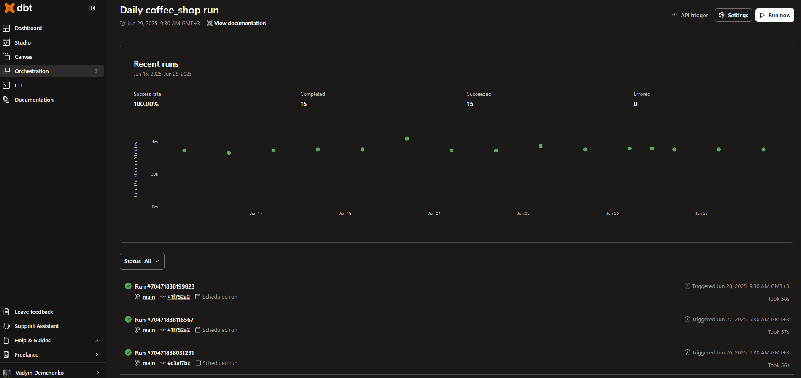
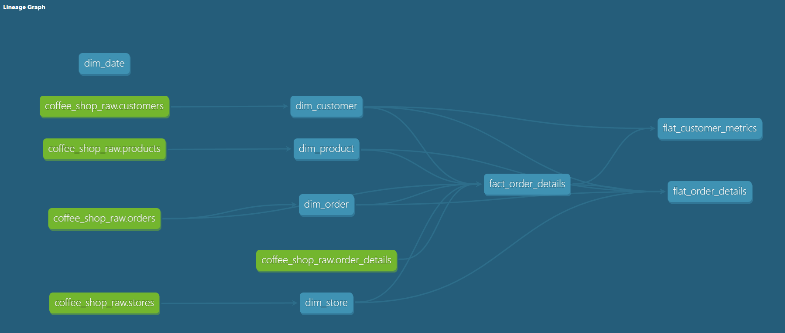

# Showcase: Local Coffee Shop — Full-Stack Analytics Workflow on GCP

This project simulates an analytics workflow for a fictional local coffee shop chain in Kyiv. It demonstrates the full journey from synthetic data generation to reporting, using Google Cloud services.

The goal: transform raw operational data into meaningful insights on sales, customer loyalty, and store performance — powered by dbt, BigQuery, and Looker Studio, with automated refresh via Cloud Run and Cloud Functions.

---
**Tech Stack**: Python · dbt · BigQuery · Google Cloud (GCS, Cloud Run, Functions, Scheduler) · Looker Studio

---

## How It Works

This showcase follows a full-stack analytics flow, from data generation to cloud automation and visualization:

1. [Generate and Upload Data](#1-generate-and-upload-data)  
2. [Load to BigQuery](#2-load-to-bigquery)  
3. [Automated Refresh](#3-automated-refresh)  
4. [Transform with dbt](#4-transform-with-dbt)  
5. [Reports in Looker Studio](#5-reports-in-looker-studio)

---

### 1. Generate and Upload Data

Synthetic data is created to simulate a realistic coffee shop business — including customers, orders, products, stores, and order details (items within orders).

This step is handled by a custom data generator deployed as a **Cloud Run job** (`coffee-data-job`). It runs automatically as part of the scheduled pipeline and saves generated CSVs to a **Google Cloud Storage (GCS)** bucket.

🔍 Click to see details

The Cloud Run service uses the `google_cloud_run/generate_and_store` folder, which contains:

- `main.py` – the core data generation script  
- `Dockerfile` – used to containerize and deploy the job  
- `requirements.txt` – specifies dependencies (`pandas`, `numpy`, `google-cloud-storage`)

**Main logic overview (`main.py`):**

1. **Generate static tables**  
   - `Customers.csv` – ~500 registered customers with loyalty levels and registration dates  
   - `Products.csv` and `Stores.csv` – fixed reference data for menu items and store locations  

2. **Generate dynamic tables**  
   - `Orders.csv` and `OrderDetails.csv` – simulate daily order activity using a Poisson distribution  
   - Includes both in-store and takeaway orders, registered and anonymous customers, variable discounts, and multi-item purchases  

3. **Upload to GCS**  
   - All CSVs are saved to the GCS bucket at:  
     `gs://coffee-shop-showcase/csv_sources/`

The job is deployed and triggered by **Cloud Scheduler** to run on a daily schedule.

> ℹ️ **Note**  
> A local version of the data generation script is available in `dataset_generation/` for manual runs or offline testing.  
> A local version of the data upload script is available in `dataset_upload/` for manual GCS uploads.

---

### 2. Load to BigQuery

Once the CSV files are uploaded to Google Cloud Storage, a dedicated **Cloud Function** (`load-bq-from-csv`) is triggered to load the data into **BigQuery** staging tables.

🔍 Click to see details

The Cloud Function uses the `google_cloud_run/load_to_bq` folder, which contains:

- `main.py` – the function logic to load each CSV file  
- `requirements.txt` – dependencies (`functions-framework`, `google-cloud-bigquery`)

**Main logic overview (`main.py`):**

1. **Environment-configured setup**  
   The function reads the following variables from the environment:
   - `PROJECT_ID`, `DATASET`, `BUCKET`, and `GCS_PREFIX`  

2. **Mapped loading**  
   Each CSV file from GCS is mapped to a corresponding BigQuery table:
   - `Customers.csv` → `customers`  
   - `Orders.csv` → `orders`  
   - `OrderDetails.csv` → `order_details`  
   - `Products.csv` → `products`  
   - `Stores.csv` → `stores`  

3. **Load job details**  
   - Format: CSV  
   - Autodetect schema  
   - Skips header row  
   - Fully replaces table (`WRITE_TRUNCATE`) on each load

All tables are loaded into the raw staging dataset for downstream dbt transformations.

---

### 3. Automated Refresh

The entire pipeline is fully automated using **Cloud Scheduler** and supporting services. Two scheduled jobs coordinate daily refresh of both data generation and loading.

🔍 Click to see details

This automation relies on the `google_cloud_run/trigger_cloud_run_job` folder, which includes:

- `main.py` – a Cloud Function that triggers a Cloud Run job programmatically  
- `env.yaml` – used to pass environment variables during deployment  
- `requirements.txt` – dependencies (`google-auth`, `requests`, `functions-framework`)

**Automation flow:**

1. **Cloud Scheduler: `coffee-job-schedule`**  
   - Runs daily  
   - Sends an HTTP request to the **`trigger-job` Cloud Function**, which is deployed from `main.py`

2. **Cloud Function: `trigger-job`**  
   - Authenticates using its service account  
   - Sends a secure POST request to Google Cloud Run API to start the `coffee-data-job` (data generation job)

3. **Cloud Scheduler: `load-bq-daily`**  
   - Runs shortly after `coffee-job-schedule`  
   - Triggers the `load-bq-from-csv` Cloud Function to load newly generated data into BigQuery

Each component is fully decoupled, ensuring modularity and control over the refresh cadence.

---

### 4. Transform with dbt

All data modeling is handled through **dbt** (Data Build Tool), using a modular, layered architecture. The goal is to create reliable, analytics-ready tables from raw transactional data by applying clear transformation steps.

This project follows a simplified but robust **data warehouse architecture**:

- **Source layer**: References raw tables from the `coffee_shop` dataset in BigQuery via `source()` definitions.
- **Dimension and fact models**: Clean, standardized models are built directly from source tables without an intermediate staging layer. These include `dim_customer`, `dim_product`, `dim_store`, `dim_order`, `dim_date`, and the central `fact_order_details` table.
- **Data marts**: Final reporting tables used by Looker Studio — including customer metrics, RFM segmentation, product mix analysis, and more.

Click to see modeling details

The dbt project operates directly on raw source tables defined in `sources.yml` from the `coffee_shop` BigQuery dataset. It builds a dimensional model and final data marts for reporting. Here's how the models are structured:

**Source Definitions**

The project references the following raw tables using `source()`:
- `customers`, `orders`, `order_details`, `products`, `stores`

**Dimension Models**

- `dim_customer.sql`: Renames and formats customer fields, adds a surrogate key using `customer_id`, and preserves loyalty level and registration date.
- `dim_product.sql`: Standardizes product names, categories, and prices, with a surrogate key based on `product_id`.
- `dim_store.sql`: Includes geographic and location metadata about stores. Uses `store_id` as the basis for surrogate keys.
- `dim_order.sql`: Extracts order-level information, such as order type and whether a discount was applied.

**Fact Model**

- `fact_order_details.sql`: Combines raw orders and order details, joining with dimension tables to add full context. Calculates subtotals, discount amounts, and final totals for each order item.

**Data Marts**

- `flat_customer_metrics.sql`: Builds advanced customer metrics using multiple layers:
  - Calculates order frequency, recency, and monetary value
  - Segments customers into RFM groups (e.g. Champions, At Risk, Churned)
  - Computes lifetime value (LTV), customer age, and activity indicators
- `flat_order_details.sql`: Prepares a reporting-friendly version of order items with customer, product, and store context. Includes derived fields for product mix classification (e.g. “Beverage + Pastry”)

**Scheduling**

The dbt job is deployed in dbt Cloud and scheduled to run daily after the BigQuery data load is complete. It ensures all downstream dashboards remain current.

**Daily dbt Cloud Job Run (screenshot from dbt Cloud interface):**

  

**Models Flow from dbt Docs (auto-generated DAG):** 

  

> ℹ️ **Note**  
> The dbt project is stored in a separate sub repository:  
> [`da-portfolio-dbt`](https://github.com/divider817/da-portfolio-dbt)  
> This separation is necessary because the free tier of dbt Cloud does not support subfolders within GitHub repositories reliably.  

---

### 5. Reports in Looker Studio

The final data marts created in dbt are used to power two interactive dashboards in **Looker Studio**. These dashboards are connected directly to BigQuery and are refreshed automatically as new data flows through the pipeline.

**View Dashboards:**
- [Sales Report (Looker Studio)](https://lookerstudio.google.com/reporting/ee071fa6-ba30-41a7-9ca3-3f18d2787dca)  
- [Customer Report (Looker Studio)](https://lookerstudio.google.com/reporting/52bc95d0-f932-4e58-96bf-6a8b2a2980ca)

Click to see dashboard details

**1. Sales Report**

Built on top of `flat_order_details`, this dashboard helps analyze overall sales performance and store-level activity. It includes:

- Daily revenue trends
- Order volumes over time
- Performance by store (volume, revenue, AOV)
- Product category breakdowns (Beverage, Pastry, Savory)
- Product mix insights (e.g., % of orders with multiple categories)

**2. Customer Report**

Built on top of `flat_customer_metrics`, this dashboard focuses on customer behavior and lifecycle analysis. It includes:

- RFM segmentation (Champions, Loyal, Churned, etc.)
- Lifetime value (LTV) and customer age
- Registered vs anonymous customer behavior
- Repeat purchase rates and activity windows
- Breakdown of customer base by discount level

Each dashboard is fully interactive and supports filtering by date, store, and order type.

---

### Notes

This project is for demonstration purposes only. The data is synthetic and the pipeline is designed to simulate real-world workflows.  
Most of my real-world work is under NDA. This showcase demonstrates how I typically approach data modeling, automation, and reporting in production-ready workflows.

---

### Back to Portfolio

[⬅ Return to main portfolio README](../README.md)

---

## Contact

For questions or feedback, feel free to reach out:
- **LinkedIn**: [Vadym Demchenko](https://www.linkedin.com/in/vadym-demchenko-a57870151/)
- **UpWork**: [Vadym Demchenko](https://www.upwork.com/freelancers/~010dc7bf506363917e?mp_source=share)

---

Thank you for reviewing this showcase!

